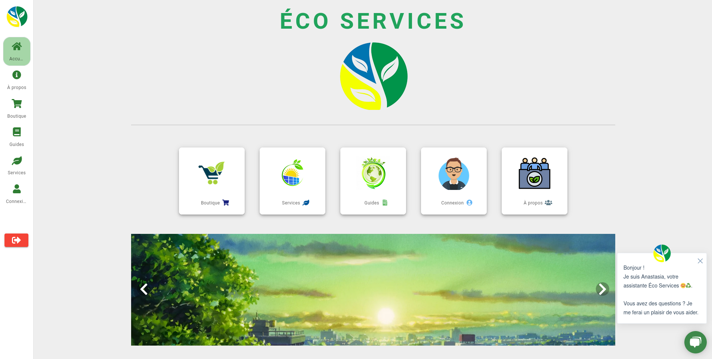
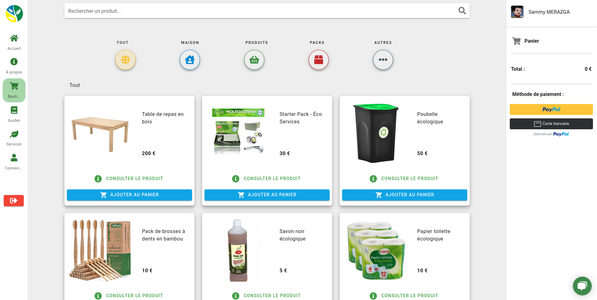
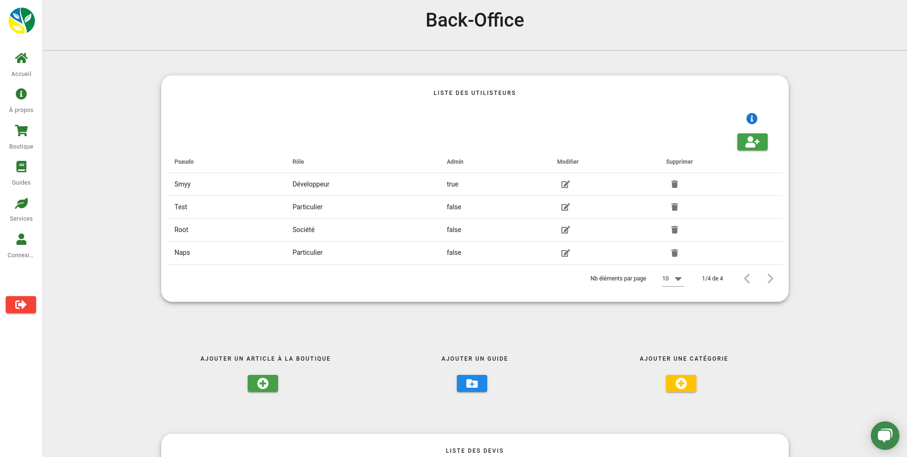
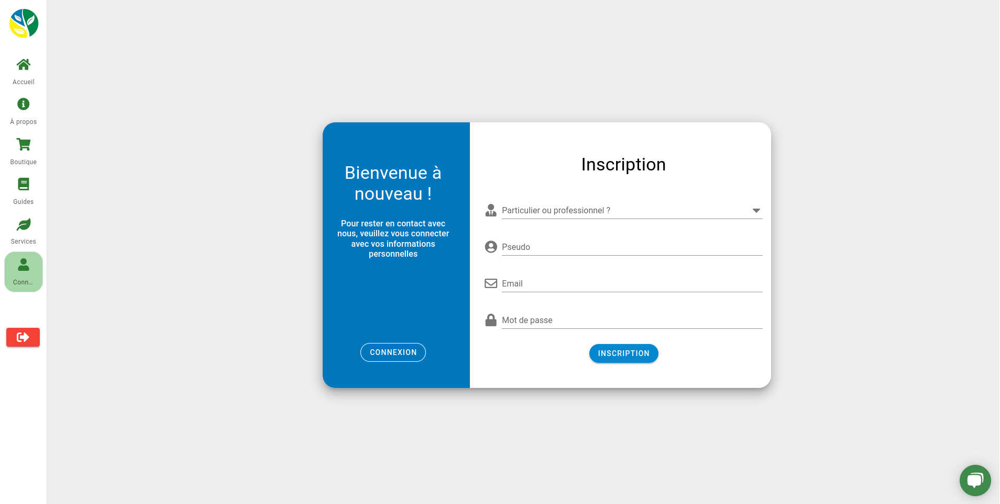

## This is a project of the G4 Institute. We have to make an e-commerce site with a payment and authentication module.

You can also see the back-end of this application 👉 https://github.com/SammyMERAZGA/serverEcoServices

Vidéo de présentation du site 👉 https://www.youtube.com/watch?v=zK0qlizR8eg

## Home Page 🏠



## Store Page 🛍️



## Back-Office Page 🛠️



## Register Page 🔏



~ Technologies used 💻

&nbsp;
&nbsp;
&nbsp;

&nbsp;
&nbsp;
&nbsp;

&nbsp;
&nbsp;

## Project setup 👇
```
yarn install
```
### Compiles and hot-reloads for development
```
yarn serve
```
### Compiles and minifies for production
```
yarn build
```
### Lints and fixes files
```
yarn lint
```
